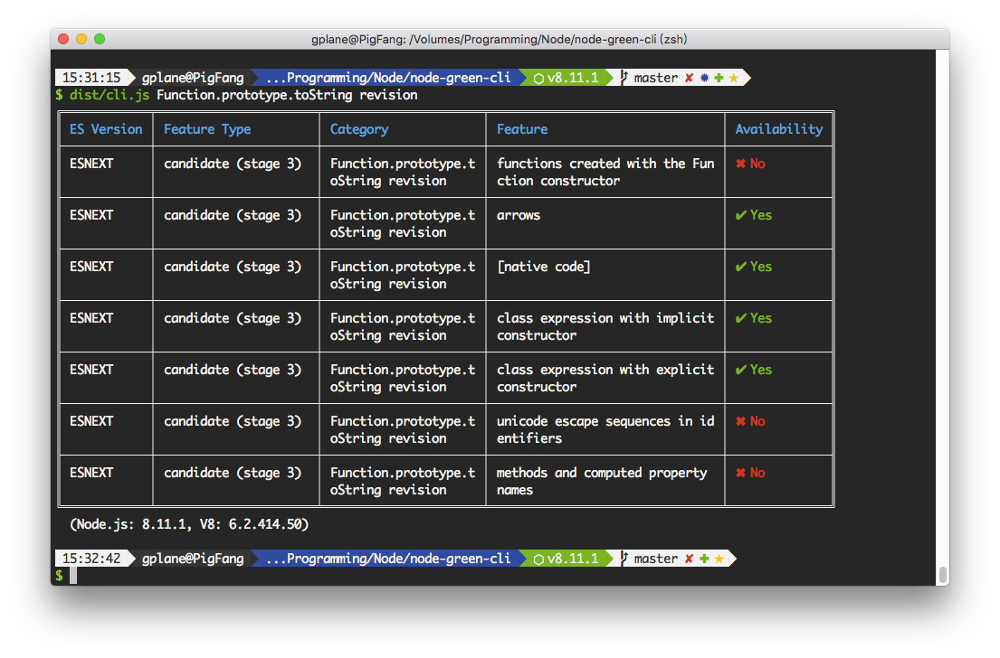

# node-green-cli

CLI for [node-green](https://github.com/g-plane/node-green) module.



[](https://travis-ci.org/g-plane/node-green-cli)
[](https://github.com/g-plane/node-green-cli/blob/master/LICENSE)
[](https://www.npmjs.com/package/node-green-cli)
[](https://www.npmjs.com/package/node-green-cli)

## Installation

Using Yarn:

```bash
$ yarn global add node-green-cli
```

Using npm:

```bash
$ npm install -g node-green-cli
```

## Usage

In your terminal:

```bash
$ node-green Array.prototype.includes
$ node-green --node-version=6.4.0 Array.prototype.includes
$ node-green --allow-harmony Array.prototype.includes
```

## Related Projects

[node-green](https://github.com/g-plane/node-green) - API for this module.

## License

Apache License 2.0

Copyright (c) 2018-present Pig Fang
